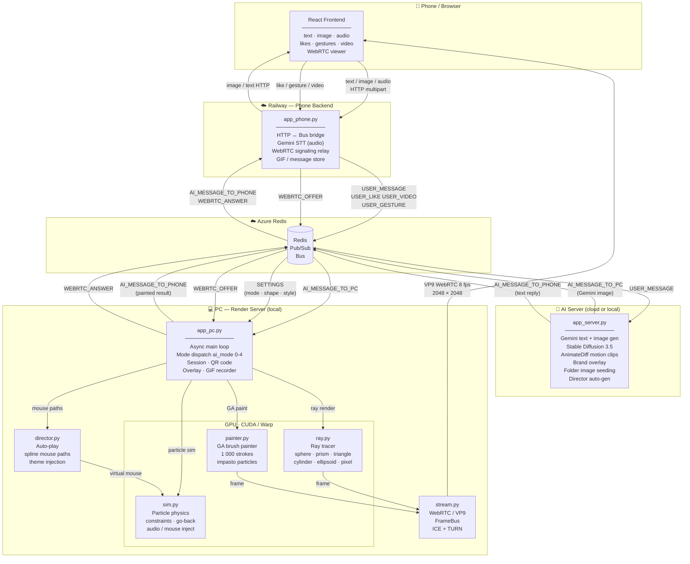

# TFNCA Architecture

```mermaid
flowchart TB
    subgraph Client["📱 Phone / Browser"]
        FE["React Frontend\n─────────────\ntext · image · audio\nlikes · gestures · video\nWebRTC viewer"]
    end

    subgraph Railway["☁️ Railway — Phone Backend"]
        PB["app_phone.py\n─────────────\nHTTP ↔ Bus bridge\nGemini STT (audio)\nWebRTC signaling relay\nGIF / message store"]
    end

    subgraph AzureRedis["☁️ Azure Redis"]
        R[("Redis\nPub/Sub\nBus")]
    end

    subgraph AIServer["🤖 AI Server  (cloud or local)"]
        APP_S["app_server.py\n─────────────\nGemini  text + image gen\nStable Diffusion 3.5\nAnimateDiff motion clips\nBrand overlay\nFolder image seeding\nDirector auto-gen"]
    end

    subgraph PC["💻 PC — Render Server  (local)"]
        APP_P["app_pc.py\n─────────────\nAsync main loop\nMode dispatch  ai_mode 0-4\nSession · QR code\nOverlay · GIF recorder"]

        subgraph GPU["GPU  ·  CUDA / Warp"]
            SIM["sim.py\nParticle physics\nconstraints · go-back\naudio / mouse inject"]
            RAYTR["ray.py\nRay tracer\nsphere · prism · triangle\ncylinder · ellipsoid · pixel"]
            PAINT["painter.py\nGA brush painter\n1 000 strokes\nimpasto particles"]
        end

        DIR["director.py\nAuto-play\nspline mouse paths\ntheme injection"]
        STR["stream.py\nWebRTC / VP9\nFrameBus\nICE + TURN"]
    end

    FE -- "text / image / audio\nHTTP multipart" --> PB
    FE -- "like / gesture / video" --> PB

    PB -- "USER_MESSAGE\nUSER_LIKE  USER_VIDEO\nUSER_GESTURE" --> R
    PB -- "WEBRTC_OFFER" --> R

    R -- "USER_MESSAGE" --> APP_S
    APP_S -- "AI_MESSAGE_TO_PC\n(Gemini image)" --> R
    APP_S -- "AI_MESSAGE_TO_PHONE\n(text reply)" --> R

    R -- "AI_MESSAGE_TO_PC" --> APP_P
    R -- "SETTINGS\n(mode · shape · style)" --> APP_P
    R -- "WEBRTC_OFFER" --> APP_P

    APP_P -- "particle sim" --> SIM
    APP_P -- "ray render" --> RAYTR
    APP_P -- "GA paint" --> PAINT
    APP_P -- "mouse paths" --> DIR
    DIR -- "virtual mouse" --> SIM
    RAYTR -- "frame" --> STR
    PAINT -- "frame" --> STR

    APP_P -- "AI_MESSAGE_TO_PHONE\n(painted result)" --> R
    APP_P -- "WEBRTC_ANSWER" --> R

    R -- "AI_MESSAGE_TO_PHONE\nWEBRTC_ANSWER" --> PB
    PB -- "image / text  HTTP" --> FE

    STR -- "VP9  WebRTC  8 fps\n2048 × 2048" --> FE
```
